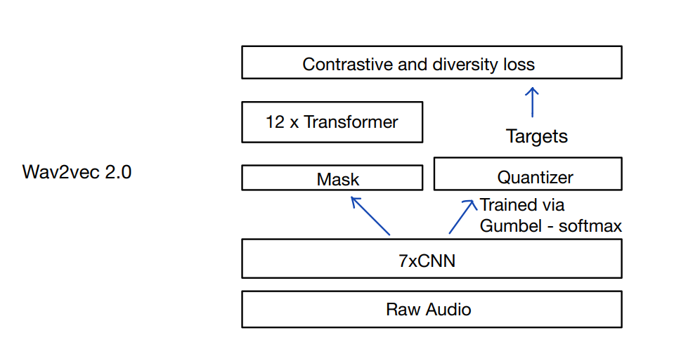
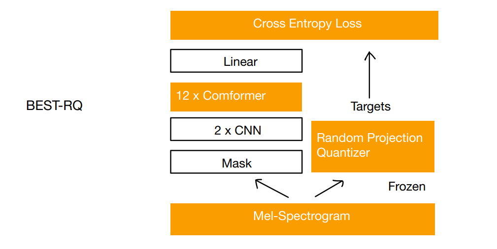

# Best-RQ

A Self-supervised learning Framework

Paper: ["Self-supervised Learning with Random-projection Quantizer for Speech Recognition"](https://proceedings.mlr.press/v162/chiu22a/chiu22a.pdf)

Experiments: 
- Pre-train using LibriSpeech, batchsize:13min, 87k steps on 4x 11 GB 2080 Ti
- Some Downstream Tasks (Finetune, Automatic Speech Recognition (ASR), Automatic Speaker Verification (ASV), Emotion Recognition (ER))

Conclusion: 
- BEST-RQ pre-trains 2.4x faster than wav2vec 2.0;
- Similar performance on downstream tasks.

wav2vec 2.0: ["wav2vec 2.0: A Framework for Self-Supervised Learning of Speech Representations"](https://arxiv.org/pdf/2006.11477.pdf)

Whisper: ["Robust Speech Recognition via Large-Scale Weak Supervision"](https://proceedings.mlr.press/v202/radford23a/radford23a.pdf)

## Related Paper
- Conditional Paper: ["Conditional Adapters: Parameter-efficient Transfer Learning with Fast Inference"](https://proceedings.neurips.cc/paper_files/paper/2023/file/19d7204af519eae9993f7f72377a0ec0-Paper-Conference.pdf) 