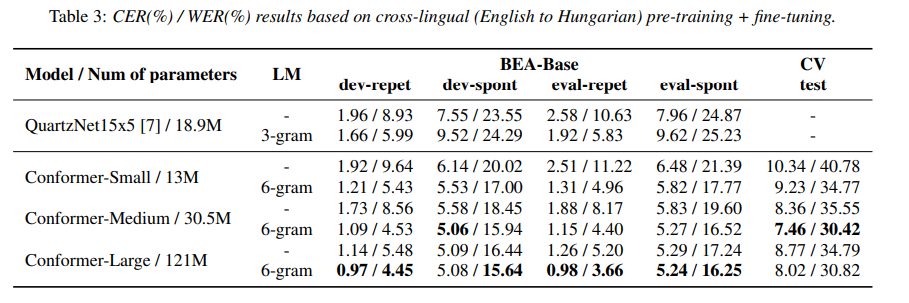
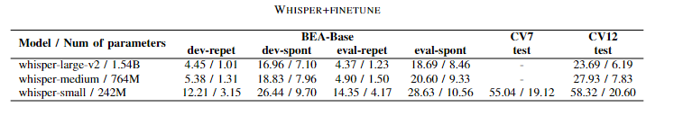

# Complex Exam

## Explore how to reduce the word error rate in cross-language research on Hungarian based on the BEA-Base dataset

### Group1: Training Hungarian dataset based on different models

Conformer Fast-Conformer model: \
**Conference1**: [Sigul2023](https://sigul-2023.ilc.cnr.it/wp-content/uploads/2023/08/25_Paper.pdf) \
What kind of multi- or cross-lingual pre-training is the most effective for a
spontaneous, less-resourced ASR task? \
**Journal1**: (that I will submit)

In my research, I confirmed that using the English pre-trained Conformer model to train 
the Hungarian dataset (BEA-Base) can achieve higher accuracy. 
At the same time, if fast-conformer pre-trained model is used for training, similar results can be obtained 
in a shorter time and with less GPU memory consumption. 

Whisper model: \
**Journal1**: (that I will submit)

Adapter Model:
**Journal1**: (that I will submit)

### Group2: Reducing word error rates for spontaneous speech in the BEA-Base dataset
**Conference2**: InterSpeech2024(Submitted) \
On Disfluency and Non-lexical Sound Labeling for End-to-end Automatic
Speech Recognition 

We compared several disfluency and non-lexical sound labeling approaches on the recognition of 
spontaneous Hungarian speech, We demonstrate that separate error rate measurement for non-lexical tokens and/or the 
clarification on what type of tokens contribute to WER is highly relevant.

### Group3: Training Hungarian dataset based on different data processing methods
**Conference3**: [Wins2024](https://repozitorium.omikk.bme.hu/server/api/core/bitstreams/b9ace940-644d-4a77-ac64-93ac1e8b022f/content) \
Model-centric data selection: Refining end-to-end speech recognition

**Conference4**: [Sigul2024]() \
Tandem Long-Short Duration-based Modeling for Automatic Speech Recognition